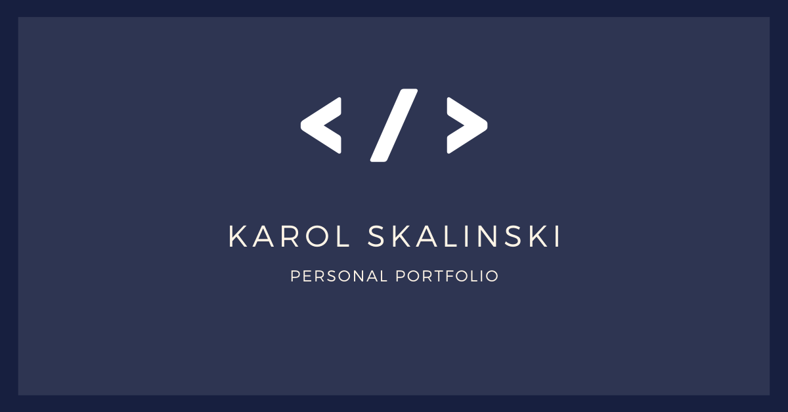

My personal webside built during WTF - Co Ten Frontend course. [https://cotenfrontend.pl/](https://cotenfrontend.pl/)

[Demo](https://skalutki.github.io/) 🔥

## **Tool & technologies I've used:

- Visual Studio Codee
- SASS
- BEM
- Fetch API
- CSS Grid

## Uses starter kit provided during the course. 

### To run this webside local:
1. `npm install -g gulp-cli`

2. `npm install`

3. `gulp`

To publish your page using github pages use `npm run deploy`

